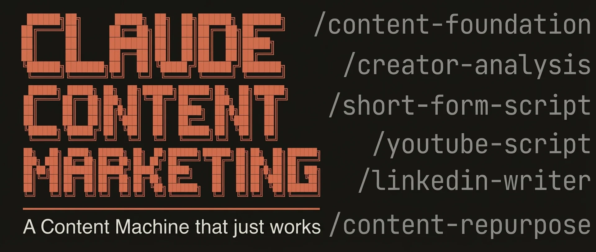

<!-- Updated: 2026-02-15 -->



# Claude Content Marketing

6 Claude Code skills that give you an AI-native content engine — from strategy to scripts to multi-platform distribution. Built by [Trueframe](https://www.trueframe.xyz), a premium video content agency that's generated 8+ figures in revenue for founders and high-growth brands. These are the same workflows we run internally, open-sourced for anyone to use. The system learns your voice, studies creators you admire, and produces content across TikTok, YouTube, LinkedIn, and X — all from your terminal.


[](https://claude.ai/claude-code)
[](LICENSE)

## Installation

### Quick Install (macOS/Linux)

```bash
git clone https://github.com/benchuayz/contentmarketingskills.git
cd contentmarketingskills
claude
```

### Prerequisites

- [Claude Code](https://claude.ai/claude-code) installed (`npm install -g @anthropic-ai/claude-code`)
- An [Anthropic API key](https://console.anthropic.com/) (~$5-20/month for active use)
- Optional: [yt-dlp](https://github.com/yt-dlp/yt-dlp) for automatic YouTube transcription

## Quick Start

```bash
# Set up your content strategy (one-time, ~10 minutes)
/content-foundation

# Analyze 3 creators you admire and extract their style
/creator-analysis

# Generate short-form scripts
/short-form-script

# Write a full YouTube script
/youtube-script

# Create LinkedIn posts
/linkedin-writer

# Repurpose any content across all platforms
/content-repurpose
```

### Demo:

[Watch the full demo on YouTube](#)

## Skills

| Skill | Description |
|-------|-------------|
| `/content-foundation` | Build your content strategy, voice profile, proof points, and audience in 10 minutes. Everything else references this. |
| `/creator-analysis` | Give it 3 creators you admire. It analyzes their style, extracts patterns, and generates sample scripts blending their voice with yours. |
| `/short-form-script` | Generate TikTok, Reels, and Shorts scripts with 50+ proven hook formulas. Flowing spoken-word — no labeled sections. |
| `/youtube-script` | Full YouTube scripts with title options, thumbnail concepts, and retention hooks every 2-3 minutes. |
| `/linkedin-writer` | LinkedIn posts using 12 proven viral formats. Founder-to-founder voice. No corporate speak. |
| `/content-repurpose` | Turn one YouTube video, podcast, or blog post into short-form scripts + LinkedIn posts + tweets + newsletter sections. |

## How It Works

**Step 1:** Run `/content-foundation` (10 minutes, one-time setup)
Your content strategy, voice, audience, and proof points. This is the foundation everything else builds on.

**Step 2:** Run `/creator-analysis` with 3 creators you admire (optional but recommended)
Extracts their style patterns and creates a voice profile that all other skills reference.

**Step 3:** Use any skill anytime
- Need short-form scripts? `/short-form-script`
- Working on a YouTube video? `/youtube-script`
- Want LinkedIn posts? `/linkedin-writer`
- Have a podcast episode to repurpose? `/content-repurpose`

Each skill reads your content strategy and style profile automatically. The more you use them, the better they get.

## What Makes This Different

- **Flowing spoken-word** — Scripts read like someone talking, not a template with HOOK/BODY/CTA labels
- **Learns your voice** — The style extractor captures YOUR patterns, not a generic "professional" tone
- **50+ proven hook formulas** — Real hooks from viral content, categorized by psychological trigger
- **Built-in quality checks** — Every skill runs a "read-it-aloud test" that catches AI-sounding output
- **Platform-native** — LinkedIn posts sound like LinkedIn. Tweets hit like tweets. Scripts flow like natural speech.
- **Iterative** — Every skill has a feedback round. You refine, it learns.

## Architecture

```
.claude/skills/          — 6 content creation skills
references/              — Hook formulas, interest peaks, persuasion frameworks, viral formats
examples/                — Sample content strategy, style profile, and scripts
my-content/              — Your generated content goes here (gitignored)
```

## Examples

Check the `examples/` folder to see what the output looks like:
- [Sample Content Strategy](examples/sample-content-strategy.md) — What `/content-foundation` produces
- [Sample Style Profile](examples/sample-style-profile.md) — What `/creator-analysis` produces
- [Sample Scripts](examples/sample-short-form-scripts.md) — What `/short-form-script` produces

## Optional: YouTube Transcription

Some skills can automatically pull transcripts from YouTube videos. To enable this:

```bash
# macOS
brew install yt-dlp

# Other
pip install yt-dlp
```

Not required — skills will fall back to manual paste if yt-dlp isn't installed.

## Built by Trueframe

These skills are built by [Trueframe](https://www.trueframe.xyz), a premium done-for-you video content agency for founders. We use Claude Code internally to produce content for clients generating 7-8 figures.

These are the generalized, open-source versions of our internal tools. If you want the premium version — fully tailored to your brand, your clients, and your specific workflow — that's what we do.

## License

MIT License — see [LICENSE](LICENSE) for details.

---

Built for Claude Code by [@benchuayz](https://github.com/benchuayz)
